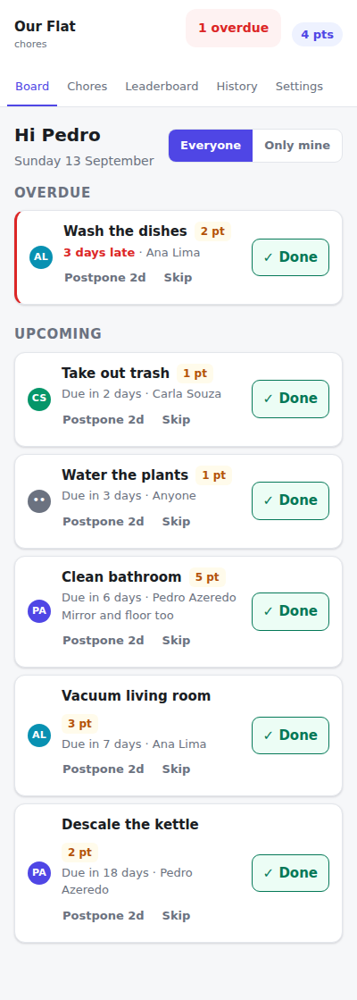
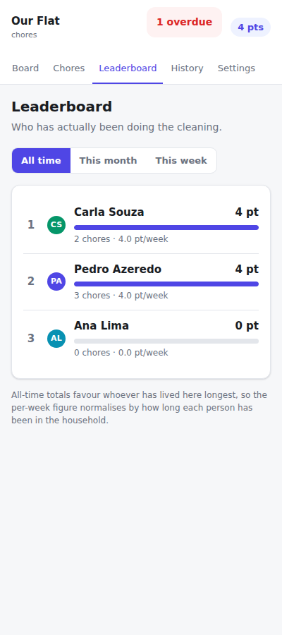

# higienizades

A small self-hosted chore board for a shared flat. Runs on a Raspberry Pi on
your home wifi, and every flatmate opens it on their phone. Recurring chores
rotate through the household, ticking one off scores points, and an all-time
leaderboard makes it visible who has actually been doing the cleaning.

No cloud, no accounts anywhere else, no internet-facing hosting.

<p>
  
  
</p>

## What it does

- **Recurring and one-off chores** — daily, every N days, weekly on a given day,
  monthly on a given date, or a single task.
- **Rotation** — each chore walks its own roster, so a chore only two people
  share doesn't drag the whole flat in. Or pin it to one person, or leave it
  open to anyone.
- **Weighted points** — taking out the trash is worth 1, scrubbing the bathroom
  is worth 5. You decide per chore.
- **All-time leaderboard**, with month and week views alongside it.
- **History** of every completion and skip, with a 24-hour undo.
- **Postpone and skip** when real life happens.
- Username and password per flatmate, so the board knows who did what.

## Running it on the Pi

You need a 64-bit Raspberry Pi OS on a Pi 4 or 5 with Docker installed
(`curl -fsSL https://get.docker.com | sh`). **Boot from an SSD or a good A2 SD
card** — cheap SD cards die under sustained database writes, and it looks like
mysterious corruption months later.

```bash
git clone <your-repo-url> higienizades && cd higienizades
cp .env.example .env
python3 -c "import secrets; print(secrets.token_hex(32))"   # paste into SECRET_KEY
docker compose up -d --build
```

Open `http://<pi-ip>:3000` and register. **The first account becomes the
household admin**; everyone after that needs the household code, which the
admin can find under Settings.

`restart: unless-stopped` plus Docker's own systemd unit means the app comes
back after a crash or a power cut on its own. There is no service of your own
to write and nothing to restart by hand.

### How everyone actually reaches it

Two things, both worth doing:

1. **mDNS.** Raspberry Pi OS ships avahi, so `http://raspberrypi.local:3000`
   works from iPhones, Macs and most Android and Windows devices with no setup.
   Rename the host to `higienizades` and it becomes
   `http://higienizades.local:3000` — much easier to tell flatmates than an IP.
2. **A DHCP reservation** in your router pinning the Pi to, say,
   `192.168.1.50`, as the fallback for whichever device's mDNS is misbehaving.

Tell everyone to open it once, sign in, then **Share → Add to Home Screen**.
They get an app icon, no browser chrome, and the 90-day session cookie means
they will essentially never log in again. Put both the `.local` name and the IP
on a note on the fridge.

### Updating

```bash
./update.sh
```

Pulls, rebuilds and restarts. Add it to cron for hands-off updates:

```
0 4 * * 1  /home/pi/higienizades/update.sh >> /tmp/higienizades.log 2>&1
```

If SSHing into the Pi is the annoying part, install
[Tailscale](https://tailscale.com) on it and on your laptop. You get SSH and
the app from anywhere over a private encrypted network, with **no ports
forwarded and nothing exposed to the internet**.

### Backups

A job at 03:00 snapshots the database into `data/backups/`, keeping the last 14.
It uses SQLite's own backup API, which is safe against a live database (copying
the file with `cp` can capture a torn write).

Copy that folder off the Pi occasionally — a backup that only exists on the
Pi's SD card is not a backup.

```bash
scp -r pi@higienizades.local:~/higienizades/data/backups ~/Desktop/
```

## How it works

### One open occurrence per chore

A **chore** is the rule ("bathroom, weekly, Saturdays, 5 points"). An
**occurrence** is one instance of that rule, and it's what you see and tap.

The app keeps **at most one open occurrence per chore**. Completing it generates
the successor immediately, so a weekly chore finished on Saturday shows
"Due in 7 days" straight away and counts down all week.

This is enforced by a partial unique index in the database, not just in code.
It buys two things: rotation stays correct when someone moves in or out
(nothing was baked in ahead of time), and a neglected chore shows as one red row
instead of five identical ones.

The trade-off is that you see the next occurrence of each chore, not a calendar
of future ones.

### Scheduling rules

- Weekly and monthly chores step from the **previous due date**, so a Saturday
  chore finished late on Monday is due the coming Saturday — not Monday + 7.
- If that step still lands in the past (nobody touched it for weeks), the next
  date re-anchors to today, so you get one upcoming chore rather than a backlog.
- Monthly chores are capped at day 28 so they also exist in February.

All of this lives in `app/scheduling.py` as pure functions, and
`tests/test_scheduling.py` is its specification.

### Points

Points are frozen onto the completion record when the chore is ticked off. If
you decide next month that the bathroom is worth 8 instead of 5, history is not
rewritten.

Credit follows **whoever actually did it**, not whoever it was assigned to. Both
are recorded, so the history can show "Ana did Bruno's trash run".

The leaderboard also shows points per week since each person joined. All-time
totals structurally favour whoever has lived there longest, and that column
keeps a new flatmate's numbers meaningful.

### Editing a chore

- **Name, description and points** apply immediately — they are read live from
  the chore, so there is nothing to migrate.
- **Schedule and assignment** are baked into the open occurrence, so the edit
  form has an *"Also update the occurrence that's currently open"* checkbox,
  ticked by default. Untick it when someone has already agreed to take this one
  as it stands.
- **Archiving** closes the open occurrence and stops generating new ones.
  Completions stay and keep counting. Restoring creates a fresh occurrence.
  Chores are never hard-deleted while history refers to them.

## A note on security

This is built for a trusted home network. Passwords are hashed with argon2 and
sessions are signed cookies, but the app speaks plain HTTP, so **passwords cross
your wifi unencrypted**. WPA2/WPA3 encrypts the link and the practical risk on a
home LAN is low, but tell everyone to pick a throwaway password rather than
reusing a real one.

Self-signed TLS is deliberately not offered: every phone would show a permanent
certificate warning, which just trains people to click through warnings. Don't
expose this to the internet.

## Development

```bash
uv venv && uv pip install -e ".[dev]"
cp .env.example .env
.venv/bin/alembic upgrade head
.venv/bin/uvicorn app.main:app --reload --port 8000
```

```bash
.venv/bin/python -m pytest      # 67 tests
.venv/bin/ruff check . && .venv/bin/ruff format --check .
```

After changing `app/models.py`:

```bash
.venv/bin/alembic revision --autogenerate -m "what changed"
.venv/bin/alembic upgrade head
```

Migrations run automatically on container start, so deploying a schema change is
just `./update.sh`.

Dependencies are declared in `pyproject.toml`; `requirements.txt` is the pinned
lock the Docker image installs. Regenerate it with
`uv pip compile pyproject.toml -o requirements.txt`.

### Layout

```
app/
  main.py         app factory, middleware, exception handlers
  models.py       the three record types: Chore, ChoreInstance, Completion
  scheduling.py   pure recurrence and rotation maths
  forms.py        chore form parsing and validation
  security.py     passwords, sessions, CSRF, auth dependencies
  views.py        shared rendering helpers
  jobs.py         hourly backfill, nightly backup
  services/       domain logic -- household, chores, completions, board, scoring
  routers/        thin HTTP layer
  templates/      Jinja2; partials/ holds the HTMX fragments
  static/         app.css and a vendored copy of htmx
```

The dashboard is the only part that uses HTMX: ticking a chore off swaps the
board and updates the navbar counters out of band, without a page reload.
Everything else is plain POST-redirect-GET, which is simpler and more robust on
a phone.

## Troubleshooting

**`unable to open database file` on first start.** The `data/` directory must be
writable by uid 1000 (the default Raspberry Pi OS user, which the container
matches). If you cloned as a different user:

```bash
sudo chown -R 1000:1000 data
docker compose restart
```

**`http://higienizades.local:3000` doesn't resolve** on one device. Use the IP
instead; mDNS support varies. `hostname -I` on the Pi tells you the address, and
a DHCP reservation in your router keeps it stable.

**Everyone was logged out at once.** `SECRET_KEY` changed — sessions are signed
with it. Restore the old value from your `.env`, or just have everyone sign in
again.

**Checking on it:** `docker compose logs -f` for the log,
`http://<pi>:3000/healthz` for a liveness check.
